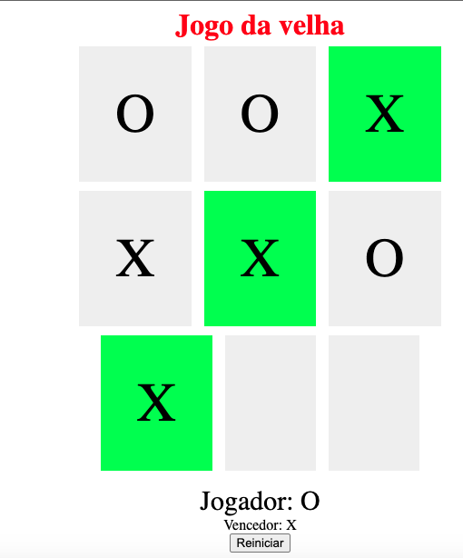

# jogo-da-velha - HTML/Javascript
 Neste projeto, vamos construir juntos um jogo da velha, utilizando somente HTML para estruturar nosso site, CSS para estilizar e dar vida a ele, e Javascript para criarmos toda suas interações, desde a escolha do jogador, efetivar uma jogada e dar um vencedor ao jogo. 
  
 Vamos abordar conceitos básicos sobre as linguagens e como podemos criar projetos bem simples sem muito trabalho, apenas utilizando suas funções básicas e uma pouco de lógica!  
   
 HTML
  
 CSS
  
 JavaScript
 
 Curso Digital Innovation One.
 
